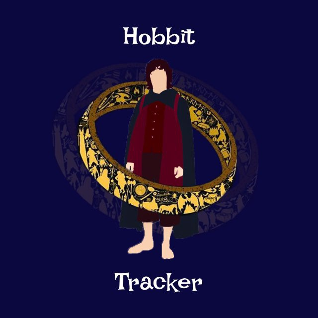

# Habit Tracker Telegram Bot 🤖

## Overview
This project is a **Telegram bot** designed to help users track their daily habits and improve productivity. The bot allows users to create, manage, and monitor habits directly from Telegram, making habit tracking simple and accessible anywhere.

## Features
- ✅ Create new habits
- 📊 Track progress daily
- 🔔 Receive reminders for habits
- 📈 View statistics of your habit streaks
- ⚡ Easy-to-use Telegram interface

## Technologies
- **Backend:** .NET 9, C#
- **Database:** SQL Server
- **Telegram Bot API:** For messaging and interaction
- **Entity Framework Core:** For database management
- **Configuration:** appsettings.json for connection strings and bot token

## Usage
- Start your bot in Telegram.
- Use `/start` to initialize.
- Use commands like `/add`, `/list`, `/delete`, `/done`, `/history` to manage your habits.
